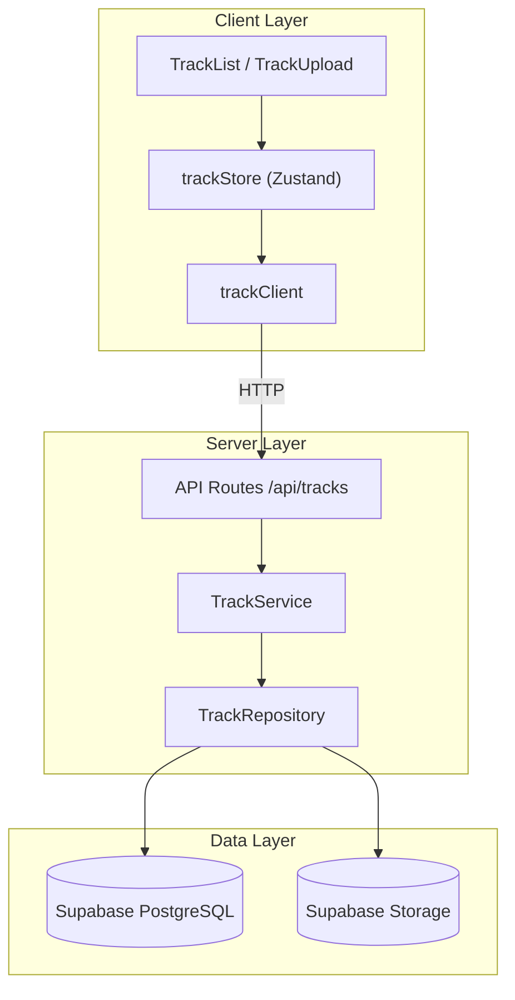
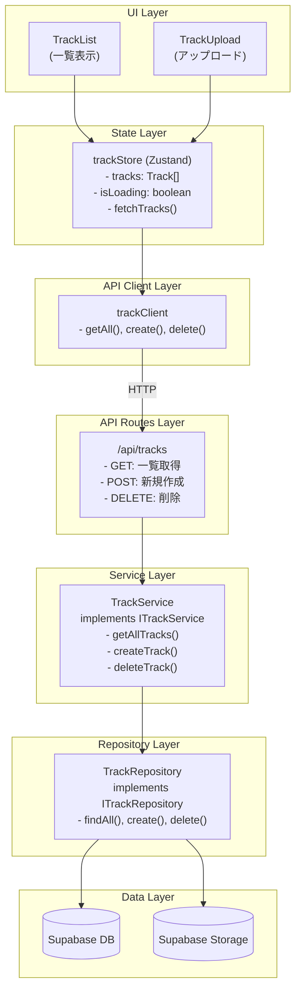

# Design Document: 楽曲管理（Track Management）

## Overview

楽曲（Track）の CRUD 操作と検索機能を提供するコア機能。サーバーサイド（API + Service + Repository）とクライアントサイド（UI + Store + Client）の両層で構成される。

## Steering Document Alignment

### Technical Standards (tech.md)

- **Next.js 16**: App Router を使用
- **Supabase**: PostgreSQL + Storage
- **TypeScript**: 厳格な型定義
- **Tailwind CSS**: スタイリング

### Project Structure (structure.md)

- **サーバーサイド**: `server/api/`, `server/services/`, `server/repositories/` に集約
- **クライアントサイド**: `components/`, `stores/`, `services/` で分離
- **型定義**: `types/models/`, `types/interfaces/`, `types/api/` で管理
- **インターフェース**: `ITrackRepository`, `ITrackService` を使用

## Code Reuse Analysis

### Existing Components to Leverage

- **Tailwind CSS**: UI コンポーネントのスタイリング
- **Supabase Client**: `server/lib/supabase.ts` で共通化

### Integration Points

- **Supabase Storage**: MP3 ファイルの保存・取得・削除
- **Supabase Database**: 楽曲メタデータの CRUD

## Architecture



### レイヤー構成



## Components and Interfaces

### Server Side

#### ITrackRepository

```typescript
// types/interfaces/track-repository.ts
export interface ITrackRepository {
  findAll(options?: { search?: string; sortBy?: string; order?: 'asc' | 'desc' }): Promise<Track[]>;
  findById(id: string): Promise<Track | null>;
  create(input: CreateTrackInput): Promise<Track>;
  delete(id: string): Promise<void>;
}
```

#### ITrackService

```typescript
// types/interfaces/track-service.ts
export interface ITrackService {
  getAllTracks(options?: TrackQueryOptions): Promise<Track[]>;
  getTrackById(id: string): Promise<Track | null>;
  createTrack(file: File, metadata?: Partial<CreateTrackInput>): Promise<Track>;
  deleteTrack(id: string): Promise<void>;
}
```

#### TrackRepository

- **Purpose:** Supabase との直接的なデータ操作
- **Interfaces:** `ITrackRepository`
- **Dependencies:** Supabase Client
- **Location:** `server/repositories/track-repository.ts`

#### TrackService

- **Purpose:** ビジネスロジック（ファイルアップロード、ID3タグ抽出、バリデーション）
- **Interfaces:** `ITrackService`
- **Dependencies:** `ITrackRepository`, Supabase Storage
- **Location:** `server/services/track-service.ts`

### Client Side

#### trackStore (Zustand)

```typescript
// stores/track-store.ts
interface TrackState {
  tracks: Track[];
  isLoading: boolean;
  error: string | null;
  searchQuery: string;
  sortBy: 'createdAt' | 'title' | 'artist';
  sortOrder: 'asc' | 'desc';
  
  // Actions
  fetchTracks: () => Promise<void>;
  uploadTrack: (file: File) => Promise<void>;
  deleteTrack: (id: string) => Promise<void>;
  setSearchQuery: (query: string) => void;
  setSortBy: (sortBy: string) => void;
}
```

#### trackClient

- **Purpose:** API との通信
- **Location:** `services/track-client.ts`
- **Methods:** `getAll()`, `create()`, `delete()`, `getById()`

### UI Components

#### TrackList (Container)

- **Purpose:** 楽曲一覧の表示、検索、ソート
- **Location:** `components/features/track-list.tsx`
- **Dependencies:** `trackStore`, `TrackItem`

#### TrackItem (Presentational)

- **Purpose:** 単一楽曲の表示
- **Location:** `components/ui/track-item.tsx`
- **Props:** `track: Track`, `onDelete: () => void`, `onClick: () => void`

#### TrackUpload (Container)

- **Purpose:** ファイルアップロード UI
- **Location:** `components/features/track-upload.tsx`
- **Features:** ドラッグ&ドロップ、複数ファイル対応、進捗表示

#### TrackDetail (Container)

- **Purpose:** 楽曲詳細表示モーダル
- **Location:** `components/features/track-detail.tsx`

## Data Models

### Track

```typescript
// types/models/track.ts
export type Track = {
  id: string;
  title: string;
  artist: string;
  album: string | null;
  duration: number;          // 秒数
  filePath: string;          // Supabase Storage パス
  fileUrl: string;           // 署名付き URL（取得時に生成）
  coverUrl: string | null;   // カバー画像 URL
  fileSize: number;          // バイト数
  createdAt: Date;
  updatedAt: Date;
};

export type CreateTrackInput = {
  title: string;
  artist: string;
  album: string | null;
  duration: number;
  filePath: string;
  fileSize: number;
  coverUrl: string | null;
};

export type TrackQueryOptions = {
  search?: string;
  sortBy?: 'createdAt' | 'title' | 'artist';
  order?: 'asc' | 'desc';
};
```

### Database Schema (Supabase)

```sql
CREATE TABLE tracks (
  id UUID PRIMARY KEY DEFAULT gen_random_uuid(),
  title TEXT NOT NULL,
  artist TEXT NOT NULL DEFAULT 'Unknown Artist',
  album TEXT,
  duration INTEGER NOT NULL,
  file_path TEXT NOT NULL,
  file_size INTEGER NOT NULL,
  cover_url TEXT,
  created_at TIMESTAMPTZ DEFAULT NOW(),
  updated_at TIMESTAMPTZ DEFAULT NOW()
);

-- インデックス
CREATE INDEX idx_tracks_title ON tracks(title);
CREATE INDEX idx_tracks_artist ON tracks(artist);
CREATE INDEX idx_tracks_created_at ON tracks(created_at DESC);
```

### Supabase Storage

```
Bucket: tracks
├── {uuid}.mp3           # 音楽ファイル
└── covers/
    └── {uuid}.jpg       # カバー画像（将来対応）
```

## API Design

### GET /api/tracks

楽曲一覧を取得

**Query Parameters:**
- `search`: 検索クエリ（タイトル、アーティスト、アルバム）
- `sortBy`: ソートキー（createdAt, title, artist）
- `order`: ソート順（asc, desc）

**Response:**
```json
{
  "tracks": [
    {
      "id": "uuid",
      "title": "Song Title",
      "artist": "Artist Name",
      "album": "Album Name",
      "duration": 240,
      "fileUrl": "https://...",
      "coverUrl": "https://...",
      "fileSize": 5242880,
      "createdAt": "2025-12-03T00:00:00Z",
      "updatedAt": "2025-12-03T00:00:00Z"
    }
  ]
}
```

### GET /api/tracks/[id]

楽曲詳細を取得

**Response:**
```json
{
  "track": { ... }
}
```

### POST /api/tracks

楽曲をアップロード

**Request:** `multipart/form-data`
- `file`: MP3 ファイル（必須）
- `title`: タイトル（任意、ID3タグから自動取得）
- `artist`: アーティスト（任意）
- `album`: アルバム（任意）

**Response:**
```json
{
  "track": { ... }
}
```

### DELETE /api/tracks/[id]

楽曲を削除

**Response:**
```json
{
  "success": true
}
```

## Error Handling

### Error Scenarios

1. **ファイルサイズ超過（50MB以上）**
   - **Handling:** アップロード前にクライアント側で検証
   - **User Impact:** 「ファイルサイズが大きすぎます（最大50MB）」

2. **非対応ファイル形式**
   - **Handling:** MIME タイプを検証（audio/mpeg のみ許可）
   - **User Impact:** 「MP3ファイルのみアップロード可能です」

3. **アップロード失敗**
   - **Handling:** リトライボタン表示、エラーログ記録
   - **User Impact:** 「アップロードに失敗しました。再試行してください」

4. **楽曲が見つからない**
   - **Handling:** 404 レスポンス
   - **User Impact:** 「楽曲が見つかりません」

5. **データベースエラー**
   - **Handling:** 500 レスポンス、エラーログ記録
   - **User Impact:** 「エラーが発生しました。しばらくしてから再試行してください」

## Testing Strategy

### Unit Testing

- **TrackRepository**: Supabase モックを使用した CRUD テスト
- **TrackService**: Repository モックを使用したビジネスロジックテスト
- **trackStore**: API モックを使用した状態管理テスト

### Integration Testing

- **API Routes**: MSW を使用したエンドポイントテスト
- **Upload Flow**: ファイルアップロード→DB保存→Storage保存の統合テスト

### End-to-End Testing

- ファイルアップロード→一覧表示→削除のフロー
- 検索・ソート機能のテスト

## File Structure

```
web/src/
├── app/
│   └── tracks/
│       └── page.tsx              # 楽曲一覧ページ
├── server/
│   ├── api/
│   │   └── tracks/
│   │       ├── route.ts          # GET, POST
│   │       └── [id]/
│   │           └── route.ts      # GET, DELETE
│   ├── services/
│   │   └── track-service.ts
│   ├── repositories/
│   │   └── track-repository.ts
│   └── lib/
│       └── supabase.ts
├── components/
│   ├── features/
│   │   ├── track-list.tsx
│   │   ├── track-upload.tsx
│   │   └── track-detail.tsx
│   └── ui/
│       ├── track-item.tsx
│       └── file-dropzone.tsx
├── stores/
│   └── track-store.ts
├── services/
│   └── track-client.ts
├── types/
│   ├── models/
│   │   └── track.ts
│   ├── interfaces/
│   │   ├── track-repository.ts
│   │   └── track-service.ts
│   └── api/
│       └── track-api.ts
└── lib/
    └── api/
        └── client.ts
```
